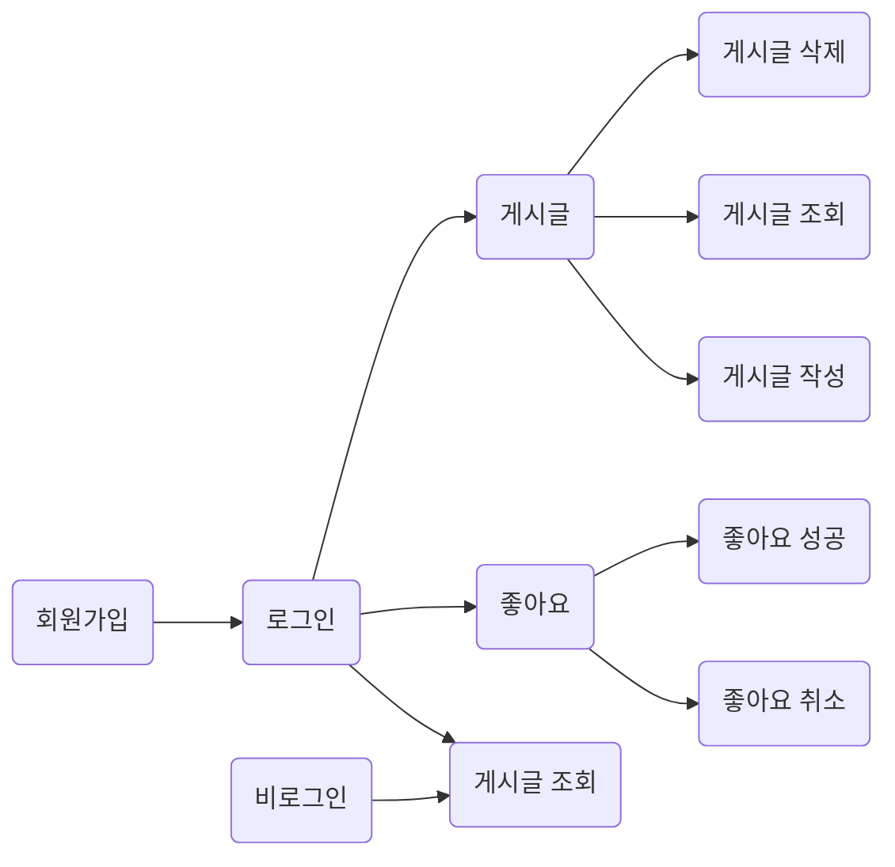

# 5기 18조 이광훈
**매거진**  만들기

## 👋프로젝트 소개
### 제작 기간
- 제작기간 :  2022.02. 18 - 2022.03.01
- --
### 조건
1. N+1 문제 해결하기
    - N+1 문제란 무엇이고, 우리 프로젝트에서 N+1 문제에 해당하는 내용 있는지 알아보고 있다면 해결하기

2. 회원 가입 페이지
    - 비밀번호는 `최소 4자 이상이며, 닉네임과 같은 값이 포함된 경우 회원가입에 실패`로 만들기
    - 비밀번호 확인은 비밀번호와 정확하게 일치하기

3. 로그인 페이지
    - 로그인 버튼을 누른 경우 아이디과 비밀번호가 데이터베이스에 등록됐는지 확인한 뒤,
      하나라도 맞지 않는 정보가 있다면 "아이디 또는 패스워드를 확인해주세요" 라는 메세지를 프론트엔드에서 보여주기

4. 로그인 검사
    - 로그인 하지 않은 사용자도, 게시글 목록 조회는 가능하도록 하기
    - 로그인하지 않은 사용자가 좋아요 버튼을 눌렀을 경우, "로그인이 필요합니다." 라는 메세지를 프론트엔드에서 띄워줄 수 있도록 예외처리 하기
    - 로그인 한 사용자가 로그인 페이지 또는 회원가입 페이지에 접속한 경우 "이미 로그인이 되어있습니다."라는 메세지로 예외처리하기

5. CORS 해결하기
    - CORS란 무엇이며, 어떤 상황에서 일어나는지 / 어떻게 해결하는지 알아보고, 프로젝트에 적용하기

------

## 🔨개발툴

+ Language
    + JAVA 11

- Framework
    - SpringBoot
    - Spring Security🔐

+ DB
    + MySql, h2, RDS

* SERVER
    * AWS EC2 (Ubuntu)

- 사용 스택
    - JPA
    - JWT
    - Filter

- 협업툴
     - git, notion

-------
### DB Architecture
| Member              |
|---------------------|
| `(Long) memberId [PK]` |
| (String) username   |
| (String) password	 |
| (String) name		  |

| Post                 |
|----------------------|
| `(Long) postId [PK]` |
| (String) contents    |
| (String) img_url	    |
| (Member) member [FK]	(ManyToOne)	 |

|Likes    |
|-------|
|`(Long) likeId [PK]` |
|(Member) member [FK]	(ManyToOne) |
| (Post) post [FK]	(ManyToOne) |
 

--------
### FLOW

-----
## API설계

### member(회원가입, 로그인)👨
|                |Http Method                        | API               |
|----------------|-----------------------------|-------------------|
| 회원가입         	 |`POST`          | /api/signup       |
| 로그인         	  |`POST`		| /api/singin	      |

**JSON형식**
- `POST : /api/signup`(회원가입) : { 
  "username":"유저아이디",  
  "password":"비밀번호",  
  "check_password":"비밀번호 확인"  
  "name":"유저 이름"  
  }
   
- `POST : /api/signin`(로그인) :{ 
  "username":"유저아이디",  
  "password":"비밀번호",  
  }

### Post(게시글)
|            | Http Method | API                |
|------------|-------------|--------------------|
| 게시글 조회     | `GET`       | /api/posts         |
| 게시글 작성   	 | `POST`		    | /api/post	         |
| 게시글 수정     | `PATCH`     | /api/post/{psotId} |
| 게시글 삭제     | `DELETE`		  | /api/post/{psotId}     |

**JSON형식**
- `POST : /api/post`(게시글 작성) : { 
  "img_url":"이미지 url",  
  "contents":"내용",  
  }
   
- `PATCH : /api/post/{psotId} `(게시글 수정) :{ 
  "img_url":"이미지 url",  
  "contents":"내용",  
  }

### Likes(좋아요)😍💚🧡
|            | Http Method | API                |
|------------|-------------|--------------------|
| 좋아요(취소,성공) | `POST`      | /api/favorite/{postId}        |

**JSON형식**
- 없음

------

## 🔷🔷🔷 1차 과제 피드백 반영 🔶🔶🔶
사실 이 부분은 프로젝트를 시작하고 피드백을 반영하면서 꼭 쓰고 싶었던 부분이다.
피드백 내용을 하나씩 살펴보자. 
>### - dto 가 너무 많으면 inner classs 를 사용해라. (피드백내용)
 DTO를 사용하면서 가장 고민했던 부분이였다. 지금은 작은 프로젝트이지만 앞으로 큰 프로젝트를 만났을 때
response, request 에 대해서 모든 dto를 만들었다가는 내 프로젝트 dto 패키지는 터지고 말것이다.
dto사용의 중요성을 배우면서 (엔터티를 return 값으로 던질 때의 오류) 사실 정확히 엔터티를 던졌을 때 
**왜?** 오류가 나는지 정확히 공부하지 못했지만 에러를 만나서 고생했기 때문에 dto를 프로젝트에 녹여내려고
노력하였다. 하지만 문제는 앞에서 말했듯이 많은 class 문서이다...
이에 대해서 코멘터 분께서 inner class 사용의 힌트를 주셨다.  
**해결 : 일반적으로 사용할 DTO를 만든 후 그 안에 static class를 생성하여 사용하는 것이다.**  
static의 사용에 대해서 공부를 하였는데 사실 inner 클래스의 용도와 이용성에 대해서는 부족하다.
클래스에 많은 dto inner class가 많겠지만 빠르게 찾아갈 수 있고 무엇보다 패키지 정리를 통해서
원하는 부분이 어디에 있는지 빠르게 찾을 수 있었다.

>### - 엔티티 생성자 접근을 쉽게하지 마라 (@NoargsConstructor(AccessLevel.PROTECTED))
아무 생각없이 생성자가 필요해  @NoargsConstructor,  @AllArgsConstructor 어노테이션을
남발했다. 
하나하나의 코드는 사실 생각을 하고 짜야함을 인지하고 있지만, 어쩌면 흘러 흘러가는대로 공부방식 때문인지
그렇게 코딩을 하지 못했다. 하지만 코멘터 분께서 해당 부분을 꼬집어 주셨음을 인지하였다.  
생성자의 접근을 쉽게하지 않아야 하는 이유를 먼저 알아보자. 
가장 중요한 이유는 무지성으로 무분별한 객체 생성에 대해 상기하기위한 이유이다. 
예를 들어 User라는 Class는 name, age, email 정보를 모두 가지고있어야만 되는 상황일경우에
기본 생성자를 막는것은 이를 도와주는 좋은 수단이 된다. 
User의 멤버변수들을 설정할 방법이 없어 Setter를 만들어서 값을 설정하지만
실수로 setAge()를 누락할 경우 객체는 불완전한 상태가 되어버린다.
따라서 생성자 접근제어를 통해서 객체의 완전성을 보장해주어야한다.  

### 🔷🔷 @Builder 의 역습!
@NoargsConstructor(AccessLevel.PROTECTED) 로 기본생성자를 접근제어 함으로써
다 됐다. 라고 생각을 할 수 있다. 하지만 문제가 있다. Builder 사용과 함께 알아보자.
@NoargsConstructor(AccessLevel.PROTECTED)과 @Builder는 같이 사용할 수 가 없다.
그렇다면 무엇을 선택해야 할까?
해당 문제는 선택의 문제가 아니다. 스프링을 허접하게 만들지 않았으니까....ㅋㅋ
사용하기 위해서는 모든 맴버변수를 받는 생성자를 만들어 준 후 @Builder을 설정해주면 된다.

------

### 질문
> ## 필터 : 

----
### 회고
> ## 🧟‍♂️이광훈  :
>  **스프링 시큐리티 흐름**  
>  토큰, 필터  
>  코멘터분의 조언

- `스프링 시큐리티 흐름` 
회원가입과 로그인 구현을 위해서 담대하게 시큐리티를 사용하였다. 
하지만 본인의 실력을 과대평가했다... 
실제 시큐리티를 자세히 공부하지 않고 사용을 하려고 하니 어떤 코드가 이부분을 구현을 해주는지 
알기가 쉽지 않았다.   로그인을 해주는 부분을 알고 싶었는데 어떤 클래스가 실행을 해주는지, 로그인 후에
어떻게 사용자 객체를 만들어 주는지 모든 부분이 익숙치 않다보니 어느시점에서 유저객체의 정보를 가져올 수 있는지
어느시점에서 예외처리를 해줘야 하는지가 예상이되지 않았다. 해당 부분은 토큰으로 이어지게 된다. 
   
- `토큰, 필터` 
세션을 이용해 시큐리티의 매운맛을 본 후 씨게 데였다고 생각하여 토큰의 사용에는 크게 무섭지 않게 달려들었다. 
하지만 다시... 본인의 실력을 과대평가했다... 
토큰은 인증과 권한을 체크하기 위해서 필터가 필요했다.
필터를 상속하여 구현하는 과정에서 뭔 소리를 하는지 1도 몰랐다. 
최범균님의 자바캔 블로그에가 필터에대해서 공부를 한 후 적용하기 시작했다. 
사실 이번에 백엔드 대부분이 세션으로 구현 후 토큰으로 바꾸었다. 
대부분이 토큰을 인프런 강의를 듣고 그대로 따오는 형식으로 작성을 하여 그렇게 하기 싫었다. 
내가 모르는 코드를 내 프로젝트에 두기가 싫었기 때문이다. 
단 한줄을 치더라도 다른사람에게 설명을 할 수 있는 코드를 치고 싶었기에
2,3 시간 하는 강의들을 듣고 따라치며 배웠다. 하지만 필터를 통한 인증과정과 흐름은 여전히
이해하기 쉽지 않았다. 다른 분들은 로그인부분을 컨트롤단 직접구현과 시큐리티의 formLogin 사용 2가지로 나뉘었다. 
나는 formLogin이 사용하는 해당 클래스를 상속하여 직접 구현하게 강의에서 배웠기에 또한 로그인이 되는과정을 
본인이 직접 보고 싶다는 생각에 구현을 하였는데 토큰의 검증과 권한이 필터를 통해서 이루어지는 과정에서
너무 뒤엉켜 쉽지 않았다.  일반적으로 블로그에 떠도는 필터를 아무것도 모르고 사용하고 싶지 않아 공부한 
필터를 직접 구현하고자 하였지만 모두 실패로 돌아갔다. 많은 시간을 허비 한 후 결국 제출기한에 부딛혀
본인 또한 블로그의 코드들을 긁어모아 작성하였다. 그래서인지 코드를 설명하라고 하면 완벽히 설명하지 못할거라
생각한다.  
다른 분들을 보면 블로그 글만 보아도 빠르게 습득하는 능력을 보며 부럽다는 생각을 하였다.
습득능력이 많이 떨어진다고 생각하여 많은 시간을 투자하자고 생각하지만 시간만큰 좋은 결과로 이어지지 못함에
어떤식으로 공부를 해야할지 감이 잡히지 않기도 하다.
이번 주차 프로젝트를 통해서는 프로젝트 데드라인의 중요성을 많이 배웠다. 이부분은 코멘터분의 코멘터와도 연결된다.
    

- `코멘터분의 조언` 
이번 프로젝트에서는 주어진 조건을 충족하지 못한 프로젝트이다. 
실제로 기한내에 주어진 과제를 어떻게든 해내는 능력 또한 매우 중요함을 이번 프로젝트를 통해서 배웟다. 
또한 본인이 갖고 있는 공부의 고집을 한 꺼풀 벗는 시간이였다. 완벽하게 공부를 하고 코드를 적용하겠다는 
생각이 좋은 자세일 수 있지만 마지노선에 놓여있다면 어떻게든 해낼 수 있는 능력이
중요하다는 것을 알게되었다. 
하지만 그래도 바꾸고 싶지 않은 고집은 아무리 급해도 모르는 코드를 갖다 놓았다해도 코드를 이해하지 못하는 
상황은 갖지 말자는 것이다. 모르는 코드를 갖다놔도 어떻게든 이해를 해야하자는 것이다.  
>**개발자는 "문제를 해결하는 직업" 이다. - 
**항해를 하는 이유**  해당 프로젝트도 개**인과제이기에 사실 팀원들과 함께 무엇인가를 할만한 껀덕지가
크지 않았다.  하지만 모르는 부분과 다른 사람의 코드를 보면서 다른 사람이 문제를 해결하기 위해서
어떠한 생각으로 코드를 작성하였는지 문제를 해결하고자 하였는지 들으며 내가 이곳에 있는 이유를 알았다. 
많은 돈을내고 가르쳐 주는 부분이 없어 갸우뚱 하였는데 가르쳐 주는건 사실 중요하지 않았다. 
무엇을 가져가는 가가 중요하지... 다른 사람의 문제 해결능력과 코드의 당위성을 듣다보니 정말 많이 배운다는 생각을 한다. 
본인도 어떠한 문제를 해결하기 위해 본인의 당위성 있는 코드를 작성하기를 바라며 오늘을 마무리한다.

